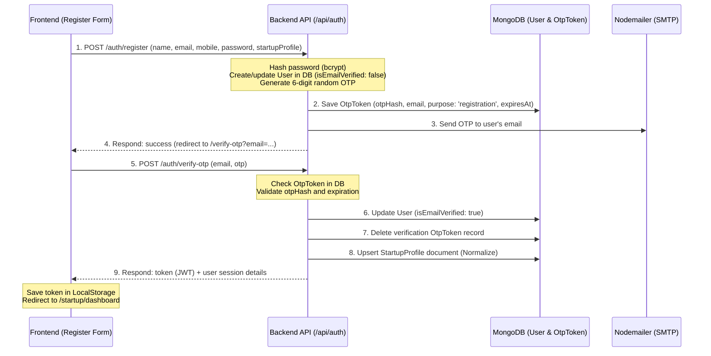

# 📄 02-architecture-workflow.md (Architecture & Workflows)

BHASKAR Startup India application client-server architecture follow karti hai, jisme stateless JWT authentication use hoti hai. Chaliye iske core workflows ko step-by-step samajhte hain.

---

## 🔐 1. Authentication & OTP Verification Flow

Jab ek naya Founder register karta hai, toh yeh process follow hoti hai:



### Flow Details in Hinglish:
1. **Registration Request**: Founder registration form ke 4 steps me fields bharte hain. Uske baad frontend `/api/auth/register` par payload bhejta hai.
2. **User Creation**: Backend pe user email ko normalize (trim + lowercase) kiya jata hai, password ko hash (`bcrypt`) karke `User` collection me save kiya jata hai. Par abhi `isEmailVerified` variable `false` hota hai.
3. **OTP Generation**: Backend ek 6-digit secret OTP generate karta hai aur uska secure hash database me store karta hai (`expiresAt` index ke sath jo 10 mins me self-delete ho jata hai).
4. **Email Dispatch**: User ko node-mailer ke SMTP server se code chala jata hai.
5. **OTP Validation**: User `/verify-otp` page par 6-digits fill karta hai. Backend hash match karta hai. Matching successful hone par:
   - `isEmailVerified` ko `true` mark kiya jata hai.
   - User ka startup profile `startups` collection me save/upsert ho jata hai.
   - Token return hota hai, jisse browser ke localStorage me save kiya jata hai (`bsi_auth_token`).

---

## 🔄 2. Startup Profile & DB Sync Workflow

Mongoose me hamare paas do main collections hain jahan startup data rehta hai:
- `users` (isme user credentials aur temporary `startupProfile` embedded schema save hota hai).
- `startups` (jo independent startup profiles hold karta hai jo search/listing pages pe show hote hain).

### Sync kaise hota hai?
- **Register & OTP verification time**: Jab verify-otp endpoint success report karta hai, toh `verifyOtp` function (jo `AppContext.tsx` me hai) `contentApi.submitStartup` ko call karta hai, jo backend route `/api/startups` par dynamic profile post karta hai.
- **Login time**: Jab bhi user `/api/auth/login` call karega, toh backend controller `login` automatically `syncStartupProfileRecord(user)` call karta hai. Yeh user ke andar store content ko fetch karke `StartupProfile` collection ke sath normalize and upsert (update-else-insert) karta hai.
- **Profile Updates**: Jab founder `Settings.tsx` se details edit karega, toh update request `/api/startups/:id` par chali jayegi, jisse real-time data sync bana rehta hai.

---

## 📝 3. Scheme Application & Vetting Flow

Jab ek verified startup seed-funds ya accelerator support ke liye apply karta hai:

```mermaid
graph TD
    A[Founder Dashboard] -->|Clicks Support Program| B(Program detail Page)
    B -->|Fills Form & Uploads Pitch Deck| C(POST /api/applications)
    C -->|Backend Validates User & Startup Profile| D{Is user.isActive == true?}
    D -- No -->|Error Toast| E[Show Profile Under Review Modal]
    D -- Yes -->|Create Application Record| F[DB: Save in 'applications' collection]
    F -->|Initial Status: 'Submitted'| G[Track Application Section visible to Founder]
    G -->|Admin reviews| H(Admin Panel: /admin/applications)
    H -->|Update status and add Remarks| I{Status update action}
    I -->|Approved/Rejected| J[Timeline Updates & Status Badge changes]
    I -->|Document Requested| K[Trigger Nodemailer: Send customized request email]
```

### Detailed steps:
1. **Application submission**: User `applyToProgram` context method trigger karta hai. Yeh check karta hai ki startup profile onboarded hai ya nahi (temp-id checks).
2. **Admin panel update**: Adol-board ya ministerial member dashboard par review items check karte hain. `/api/admin/applications/:id/status` par status aur audit remarks update karte hain.
3. **Trigger mail**: Agar admin status "Document Requested" set karta hai, toh backend automatically Nodemailer trigger karke user ko unke document links attach karne ki manual requests ka custom email bhej deta hai.

---

## 🛡️ 4. Role Authorization Routing (Frontend Router Guards)

Frontend router me roles and token existence validation ke liye route protectors lagaye gaye hain:

1. **ProtectedRoute (`/startup/*`)**:
   - Agar user logged-in nahi hai (`!user`), toh home page (`/`) par bypass redirect.
   - Agar user log-in hai aur uska role `admin` hai, toh admin dashboard (`/admin/dashboard`) par redirect.
   - Normal founders ke liye children components return honge.

2. **AdminRoute (`/admin/*`)**:
   - Agar user logged-in nahi hai, ya phir logged-in user ka role `admin` nahi hai (`user.role !== 'admin'`), toh user ko safely home page (`/`) par redirect kiya jata hai.
   - Sahi credentials pe admin dashboards and settings render honge.
